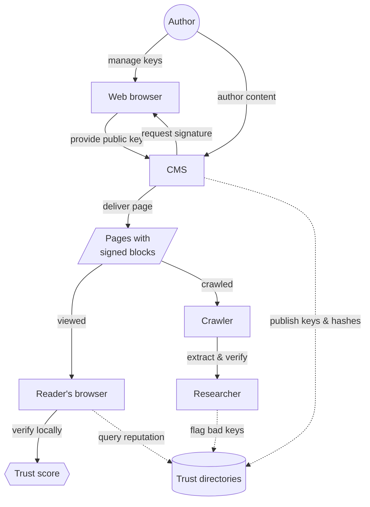
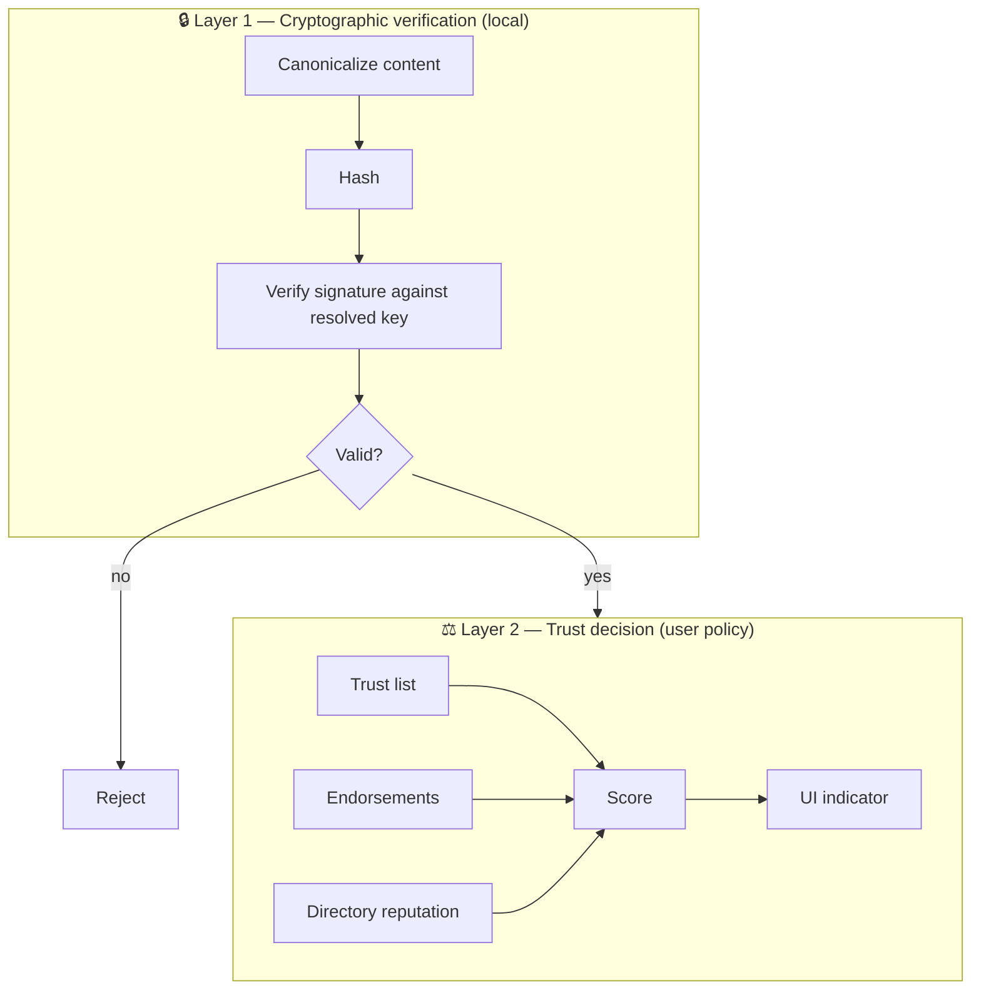
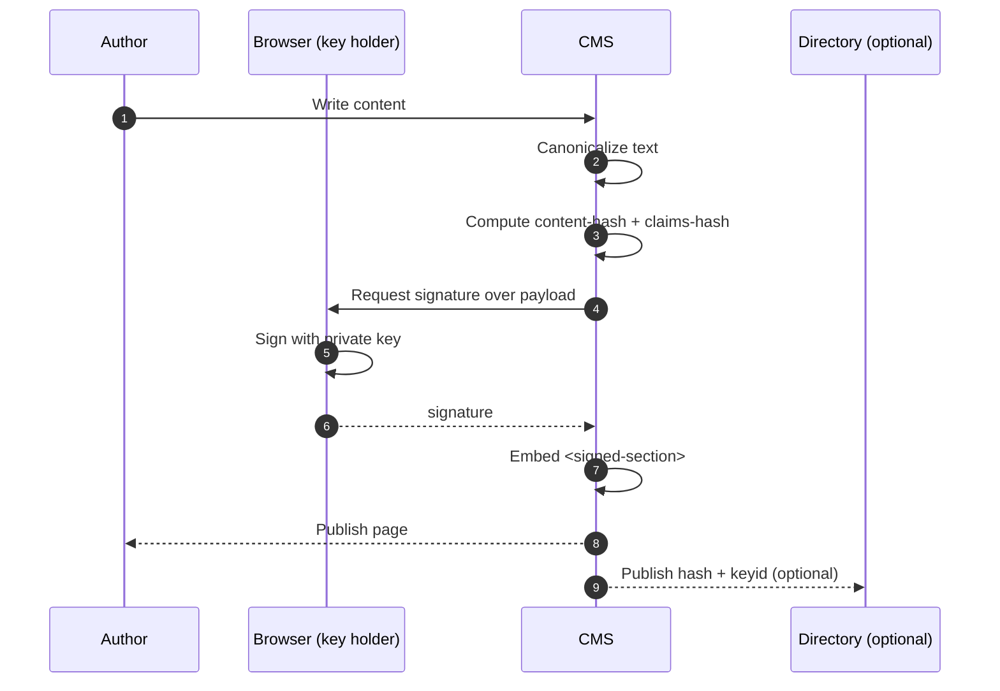
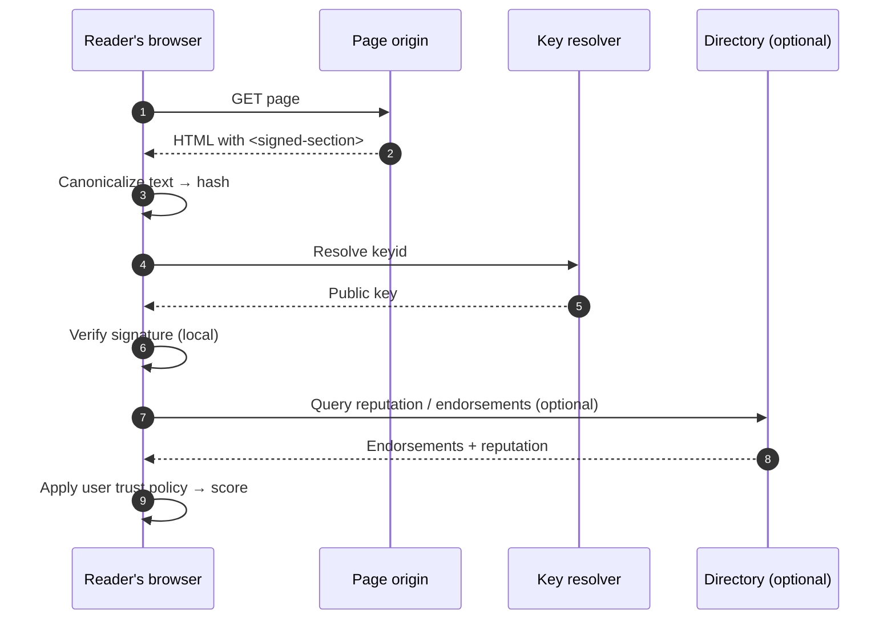
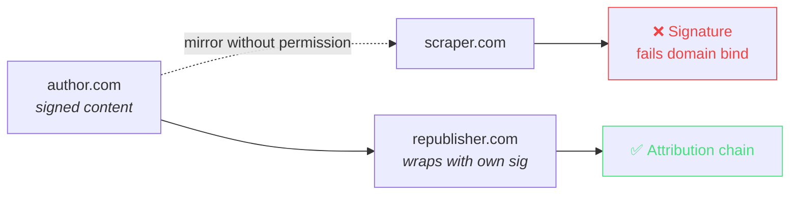

HTMLTrust is a system of small, independent pieces. Authors sign content. CMSes embed signatures. Browsers verify locally. Optional directories store endorsements and surface reputation. No piece is required for verification to work.

## The whole system, one diagram

## Two layers, kept separate

A signature either verifies cryptographically or it does not — that part is binary, local, and identical across implementations. **Trust** is a matter of degree, and each user agent applies its own policy on top.

## Author flow — signing

The private key never leaves the author's browser. The CMS asks the browser to sign a canonical payload, receives the signature, and embeds it in the published HTML.

## Reader flow — verifying

Cryptographic verification is offline-capable once the public key is cached. The directory query is optional and only feeds the *trust score*, not the signature check.

## Domain binding

A signature is bound to a publication origin via the canonical payload. Scrapers and mirror sites can copy the bytes, but the signature will not validate at a different origin. Legitimate republishing is supported via a separate mechanism: a republisher wraps the original `<signed-section>` in their own outer signature, preserving the original while adding an attribution chain.

## The directory's role

A trust directory MAY:

- **Index** content hashes and signers for discovery
- **Serve** endorsements submitted by third parties
- **Resolve** keys for authors who don't self-host (`keyid` can point at a directory entry)
- **Surface** reputation signals computed from its own curated trust graph

Federation means **many directories can coexist**, users choose which they trust at the higher level, and verification of a signature never requires contacting one. A directory is a convenience, never an authority.

## Next

- **[Spec details](/spec/)** — element, attributes, canonicalization
- **[Reference implementations](/implementation/)** — what's running today
